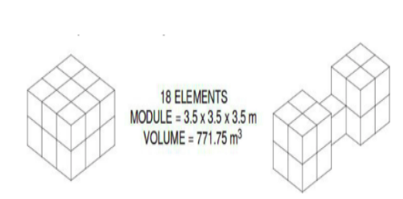
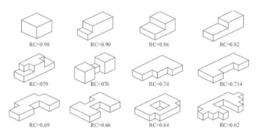
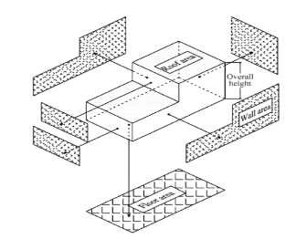
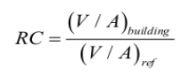

# Predicting-Energy-Loads-of-Buildings

The basic principle of building energy efficiency is to use less energy for operations including heating, cooling, lighting and other appliances, without affecting the health and comfort of its occupants. 
Improving the energy efficiency of functional buildings brings many environmental and economic benefits such as reduced greenhouse gas emissions and operational cost savings.

## Overview

Given various building features (8 variables), goal is to predict heating load and cooling load. This is a multi-target regression problem, a Multi Layer Perceptron (MLP) layer with two output nodes can solve this problem. 
Tried with various MLP architectures and many hyper parameters and find best hyper parameters to reduce R^2.
Performed exploratory data analysis and find insights of the data.

## Description

<ol>
  <li>A modular geometry system was derived based on an elementary cube (3.5 × 3.5 × 3.5m). In order to generate different building shapes, eighteen such elements were used according to Figure</li>

 

  <li> Then generated 12 structures with different shapes and Relative Compactness as shown in figure.</li>

 

  <li>
    <ul>
      <li> X1 - Relative Compactness </li>
      <li> X2 - Surface Area</li>
      <li> X3 - Wall Area  </li>
      <li> X4 - Roof Area </li>
      <li> X5 - Overall Height </li>
      <li> X6 - Orientation </li>
      <li> X7 - Glazing Area  </li>
      <li> X8 - Glazing Area Distribution </li>
    </ul>
  </li>

   Each feature is described in the figure:
  

 

  
</ol>

### Dataset
The raw data contains 768 rows each row represent a structure of the building. 8 Input Variables. Heating Load and Cooling load are our output variables.
 

Dataset reference: https://people.maths.ox.ac.uk/tsanas/Preprints/ENB2012.pdf 

### Splitting Dataset
Since the dataset is a bit small to tain a MLP, splitted dataset into 5 fold CV. Where 4 folds are for training and one fold for testing.  
Detailed explaination of 5 fold CV shown in image:

 

## Dependencies
<ol>
  <li>jupyter notebook</li>
  <li>python 3</li>
  <li>numpy</li>
  <li>matplotlib</li>
  <li>pandas</li>
  <li>seaborn</li>
  <li>keras</li>
  <li>scikit-learn</li>
</ol>

## Feature Selection
<ol>
<li> From Domain Knowledge we removed relative index feature.

 

Here, reference is common for all buildings, also volume of all buildings is same, so RC is inversly proportional to area.
  So, Refractive Compactness(RC) can be removed

More about Refractive compactness and area 
   Reference : http://www.scielo.br/scielo.php?script=sci_arttext&pid=S1678-86212017000300103#e01

</li>
<li> Filter Based
    After Forward Feature Selection, these are important features
<ol>
  <li>Surface Area </li>
  <li>Wall Area </li>
  <li>Roof Area </li>
  <li>Glazing Area </li>
</ol>
 </li>

## Statistic Test
Among several models performed stastical test to conclude best model by performing stastical test(t-test).
1. Compare MLP with different hyperparameters with and without feature selection using t-test value on R^2 value. 
2. This gives the statistical significance between different hyper parameters with and without feature selection. 
3. Calculate t-statistic with 1% level of significance and 5+5-2 = 8 degree of freedom. T - statistic value at 8 degree of freedom and 1% level of significance is 2.896.

